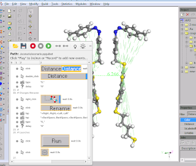

Description
===========

Tool to automate GUI interactions

It uses a plain text database with linked image patterns to find appropriate GUI-elements and simulate user interactions like mouse and keyboard events on them.

The field of tasks includes:

* semi- or full-automated GUI-interaction routines
* auto-tests of GUI-applications

Contains a GUI-tool to compose interaction scripts.  Image patterns are distorted in order to avoid self-detection.

Can be executed both as a GUI and as a command line tool.

Screenshots
===========

 
 
 

Requirements
============

* Python 3
* OpenCV
* Qt5
* etc (see requirements.txt)

How to run
==========

1. Create a local copy of the repository

> git clone https://bitbucket.org/gehrmann/pyguibot ./pyguibot-trunk

2. Launch with root-previleges (uses python/pip and apt):

> ./install-requirements.sh

or install them manually.

3. Launch program using start script:

> ./pyguibot

Documentation
=============

Automation scripts have so called tree-like branched structure.

If one branch is failed, the execution continues on the next outer branch.

Termination of the most outer branch interrupts the whole execution (as failed or done).

Every step is an action.

Supported actions
-----------------

* delay -- implements a waiting delay, in seconds, for example "2" waits 2 seconds and proceeds to next action
* jump -- proceeds to another branch, for example "-2" skips from execution of current and next outer branch
* break -- does the same as "jump" but highlights current branch (or the whole execution) as "failed"
* equation -- assigns a result of the equation to a variable, for example "X = 2" or "X = {X} or 0" to initialize, or "X = {X} + 1" to increment
* condition -- jumps to next outer branch if condition not met, for example "{X} == 2"
* shell_command -- executes an external shell command and proceeds to next outer branch if failed, for example "wmctrl -s 0"
* keyboard_* ( tap | press | release | type ) -- does a single keyboard action or typing
* mouse_* ( move | press | release | click | double_click | right_click | scroll ) -- finds appropriate GUI-elements and does mouse actions on them

Usage of variables
------------------

Variables can be initialized from program environment, therefore you can launch the program as follows:

> X=5 ./pyguibot

You can initialize it also in action "equation" like:

> "X = 2"

or

> "X = {X} or 2"  (the variable will be initialized only once during multiple runs within the scope of one program launch)

You can put variables in every action.
For example "keyboard_type" with "{COUNT} loops" will type "5 loops" if X=5 or will throw exception if X was not initialized.

Known bugs
==========

* Hangs if mouse press event is invoking outside any window (on desktop)

ToDo
====

 * Use PyAutoGUI instead of/together with pymouse/pykeyboard (https://media.readthedocs.org/pdf/pyautogui/latest/pyautogui.pdf)
 * Clean screenshots if not bound with events.log

Acknowledgments
===============

This project was supported by GU1510 5-1 (DFG)
